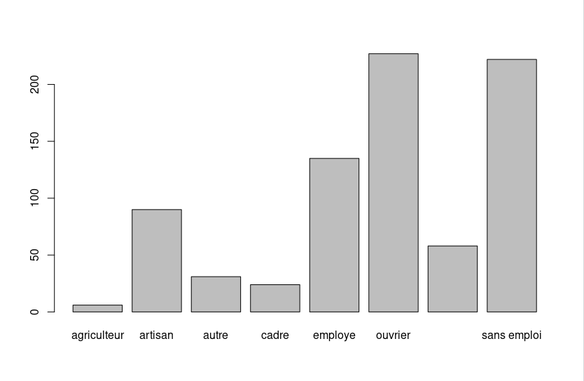
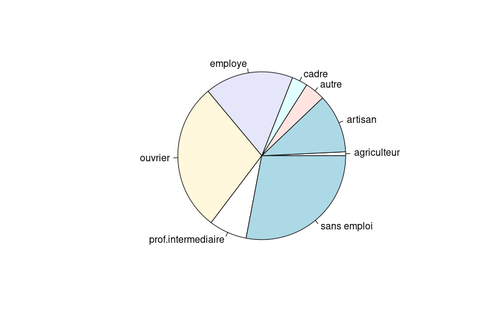
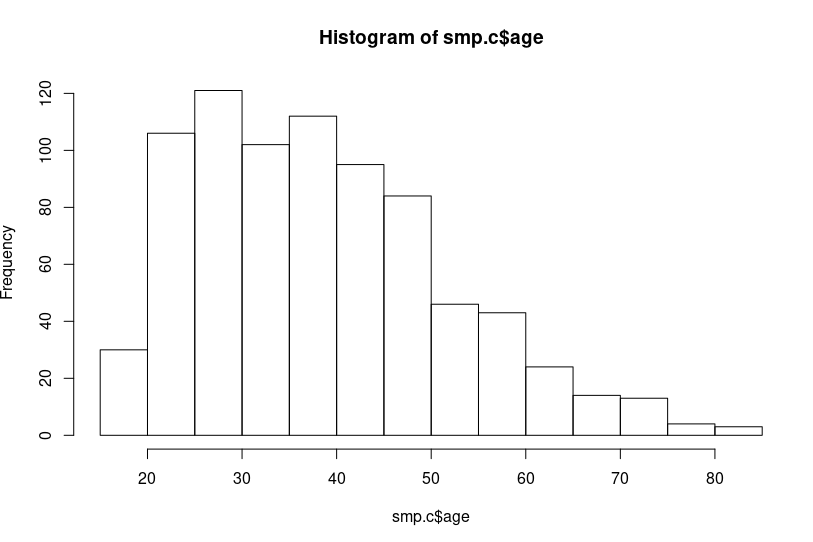

## Statistics with R

**Credits:** notes from the course [Introduction à la statistique avec R, Paris Saclay](https://www.fun-mooc.fr/courses/course-v1:ParisSaclay+71007+session14/about)

Review some notions: https://www.khanacademy.org/math/statistics-probability/analyzing-categorical-data 

Recommended book : https://rstudio-education.github.io/hopr/preface.html
R and data sciences: https://r4ds.had.co.nz/

https://rstudio-education.github.io/hopr/starting.html

data for this tutorial [here](./r-data/README.md)

### Download and installation (Ubuntu 20)

download and install last release  of R from the official website :  https://cran.r-project.org/

There is a apt for it:
        
    sudo apt install r-base

there also a links for precompiled binary versions, available for Windows, Mac and Linux.

*Rstudio*

As Rstudio for Ubuntu isn't available, download the one for Ubuntu18 Jessie. 

    dpkg -i rstudio-1.3.1073-amd64.deb

You might need to run another command to fix dependancies issues.

    sudo apt --fix-broken install
    
### Launch R interpreter, run Rstudio

Start Rstudio from the launchpad of Ubuntu

or/and

$R
runs the R interpreter in your terminal 

If you need a graphic interface, dl Rstudio https://rstudio.com/products/rstudio/download/

## Run RStudio

First install packages you'll need to draw plots: 

        Tools -> Install Packages... ->  and select package you want to install in the dialog box; here "gplots"
       
### starting keys

- In addition to the visual interface, you can launch instructions directly in the R interpretor (the **console**) and see the output (crucial for errors)
- Graphs are generated in another window.
- **R scripts** have the extention **.r**
- you hit a script by running the instruction source()

- You call the help menu by running the instruction **help()**. 

### variables

- variables names are **Case-senSitiVe** 
- Missing value is encoded such as **NA**
- mode() display the variable type *numeric* or *character* and lenght() the number of item in the variable
- factor() and levels() are helps to qualify a variable: **factor()** for what qualitative value of the variable, **labels=** for labelling the variable

to keep in mind : Variable = (element1, element2, element2, element3,...)  it's like **supervariable= []** and a lot of things inthere.

### Load data 

**tips:** Cat your file before to see what is the separator used in your data set. For example with a .csv file a "," or a ";" as separator differs the input syntax: read.csv for "," and read.csv2 for ";" 

       > smp.c <-read.csv2[file path] 
       # smp here is the file in which I lead a set of data with "<-" and the .c method and read from a file.
       
So with our data:
       > smp.c <-read.csv2("data/smp1.csv")
               
To check the data integrity : 

        > str(smp.c)
 ~~~R
 'data.frame':	799 obs. of  9 variables:
 $ age      : int  31 49 50 47 23 34 24 52 42 45 ...
 $ prof     : Factor w/ 8 levels "agriculteur",..: 3 NA 7 6 8 6 3 2 6 6 ...
 $ dep.cons : int  0 0 0 0 1 0 1 0 1 0 ...
 $ scz.cons : int  0 0 0 0 0 0 0 0 0 0 ...
 $ grav.cons: int  1 2 2 1 2 1 5 1 5 5 ...
 $ n.enfant : int  2 7 2 0 1 3 5 2 1 2 ...
 $ rs       : int  2 2 2 2 2 1 3 2 3 2 ...
 $ ed       : int  1 2 3 2 2 2 3 2 3 2 ...
 $ dr       : int  1 1 2 2 2 1 2 2 1 2 ...
 ~~~
        
## Visualizations 

### barplot
        > barplot(table(smp.c$prof))
        
        

The same thing as table in the console:
        
        > table(smp.c$prof)
 ~~~R
      agriculteur            artisan              autre              cadre            employe            ouvrier prof.intermediaire 
                 6                 90                 31                 24                135                227                 58 
       sans emploi 
               222 
 ~~~
 
 ### pie
 
        > pie(table(smp.c$prof))

### histogram

        > hist(smp.c$age)

### vocabulary:
http://vita.had.co.nz/papers/layered-grammar.pdf

